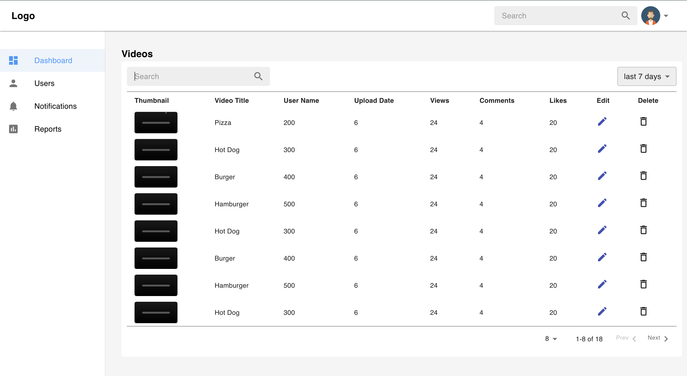

# Getting Started with Create React App

# Code Challenge

## Prerequisites

### Install NodeJS
Refer to https://nodejs.org/en/ to install NodeJS

### Install create-react-app (optional)
Install create-react-app npm package globally. This will help to easily run the project and also build the source files easily. Use the following command to install create-react-app

```bash
npm install -g create-react-app
```

## Cloning and Running the Application in local

Clone the project into local environment 

```bash
git clone https://github.com/mya2h/aevue-code-challenge.git
```

Install all the npm packages. Go into the project folder and type the following command to install all npm packages

```bash
npm install
```

In order to run the application Type the following command

```bash
npm start
```

In order to run test

```bash
npm run test
```

The Application Runs on **localhost:3000**

## Folder Structure
### components

1. **Input** Component: This Component Contains reusable Inputs

2. **Nav** Component: This Component contains reusable Nav components(top bar and side nav)

3. **Table** Component: This Component contains reusable tables.


### layout

1. **Layout**: this folder contains component for the loading page (contains top bar and side nav)
2. **Dashboard**: this folder contains components for Dashboard page

### assets

Contains all the images and styles 

### state

Contains redux action,reducers and store 


## Resources

**create-react-app**: The following link has all the commands that can be used with create-react-app
https://github.com/facebook/create-react-app

**Material UI**: Refer to https://mui.com/material-ui/getting-started/overview/ to understand the concepts of material UI design framework 

**Redux**: Refer to https://react-redux.js.org/ to understand more about the redux state managment